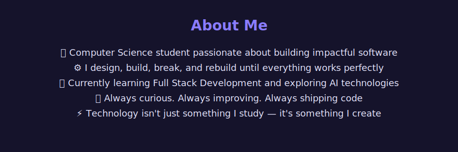

<pre>

                __     __  ___    ____   _  __ __   __           ____     ___   __   __           ____    _____ 
                \ \   / / |_ _|  / ___| | |/ / \ \ / /          | __ )   / _ \  \ \ / /          |___ \  |___ / 
                 \ \ / /   | |  | |     | ' /   \ V /           |  _ \  | | | |  \ V /             __) |   |_ \ 
                  \ V /    | |  | |___  | . \    | |            | |_) | | |_| |   | |             / __/   ___) |
                   \_/    |___|  \____| |_|\_\   |_|   _______  |____/   \___/    |_|   _______  |_____| |____/  

</pre>

  

---

# Tech Stack

---

##  GitHub Stats

 
##  Random Dev Quote

